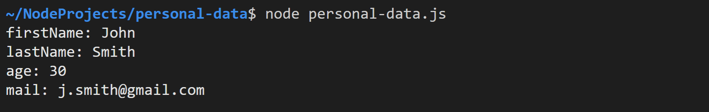
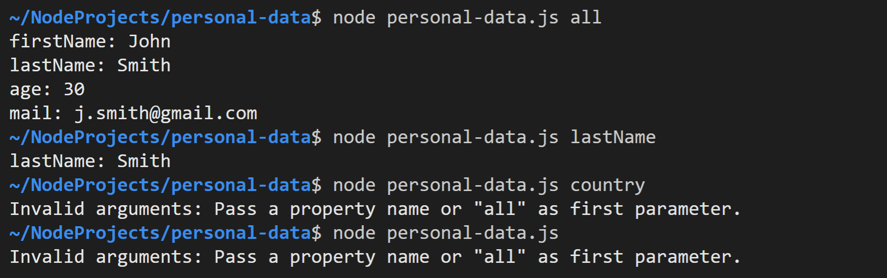
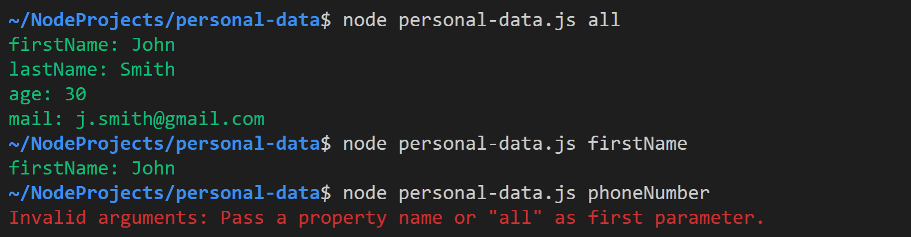
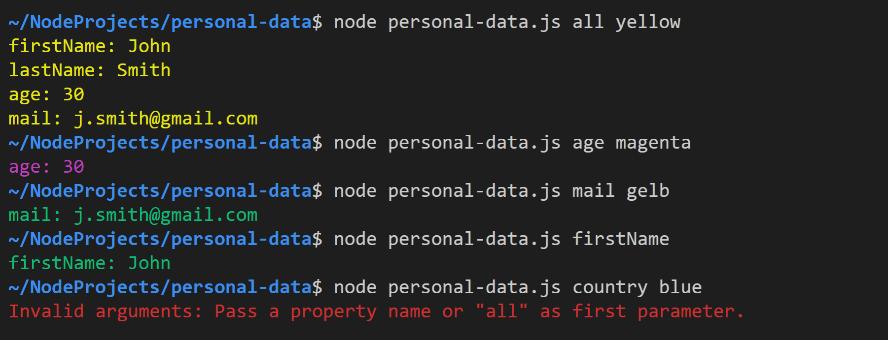

# Personal Data

Kompilieren Sie ohne die TypeScript-Datei oder den `target` Parameter anzugeben. Die notwendigen Einstellungen befinden sich bereits in der Datei `tsconfig.json`. 

Es reicht also folgenden Befehl im Terminal einzugeben: 

```bash
tsc
```

## Task 1

Erstellen Sie in der Datei `personal-data.ts` ein neues Interface `Person`, mit folgenden Eigenschaften:

- `firstName`
- `lastName`
- `age`
- `mail`

Die Email-Adresse soll dabei optional sein. Erstellen Sie anschließend ein `Person`-Objekt mit **Ihren** Daten.

Geben Sie **mithilfe einer *for-in* Schleife** alle Eigenschaften des Objekts auf der Konsole aus. Für den 30-jährigen John Smith könnte die Ausgabe folgendermaßen aussehen:




## Task 2

Die Ausgabe des Programms soll vom ersten CLI Parameter abhängen: 
- **`all`:** Wie bisher werden alle Eigenschaften ausgegeben.
- **Vorhandene Eigenschaft:** Nur diese Eigenschaft wird **mithilfe der _Bracket Notation_** ausgegeben.
- **Unbekannte Eigenschaft oder kein CLI Parameter:** Die unten dargestellte Fehlermeldung wird ausgegeben.

**Hinweis:** Jedes Objekt besitzt automatisch eine Methode `hasOwnProperty()` mit der Sie überprüfen können, ob es eine Eigenschaft mit dem übergebenen Namen besitzt.




## Task 3

Verwenden Sie das Package *chalk* um die Eigenschaften in grün und die Fehlermeldung in rot auszugeben. Vergessen Sie nicht eine `.gitignore`-Datei zu erstellen, damit der `node_modules`-Ordner nicht aus Versehen in Ihrem *GitHub* Repository landet.

Verwenden Sie am Beginn der Datei `personal-data.ts` folgende Anweisung, um das Modul zu importieren:

```typescript
import chalk from "chalk";
import { Chalk } from "chalk";
```




## Task 4

Die Farbe der Eigenschaften soll vom zweiten CLI Parameter abhängen:
- Falls `blue`, `"yellow` oder `magenta` übergeben wird, sollen die Ausgaben in der entsprechenden Farbe erfolgen.
- Falls nicht oder falls kein zweiter Parameter übergeben wurde, soll die Ausgabe weiterhin in grün erfolgen.

Implementieren Sie hierfür unterhalb des Interfaces `Person` eine Funktion, welche die korrekte `Chalk`-Methode zurückgibt (z.B. `chalk.blue`).

```typescript
function getColoredChalk(color: string): Chalk {
    ...
}
```

Rufen Sie die Funktion weiter unten folgendermaßen auf:

```typescript
const coloredChalk: Chalk = getColoredChalk(args[1]);
```

`coloredChalk` ist eine Methode, die beispielsweise folgendermaßen verwendet werden kann, um `hello world` farbig auszugeben:

```ty
coloredChalk("hello world");
```

**Achtung:** Die Fehlermeldung soll (wie unten dargestellt) immer rot ausgegeben werden!



**Anmerkung:** Eine Funktion, die eine andere Funktion zurückgibt, bezeichnet man als *higher order function*.